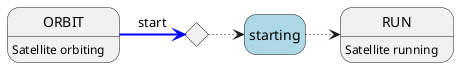

# Autonomous Operation

Constellation networks of satellites can operate autonomously from controllers.
On the one hand, this means that no controller has to be active in the network for a running data acquisition to continue,
for example. On the other hand, it also means that satellites can control certain processes themselves without the active
intervention of a controller instance. These processes and situations are described below.

All communication between satellites concerning autonomous operation is transmitted via
heartbeats between the individual nodes:

```{figure} CHP.svg
Schematic drawing of heartbeats being exchanged between three satellites of a constellation.
```

## Autonomous Transition Orchestration

In some cases it can be required to initialize, launch, start or stop satellites in a specific order - they might for example
depend on receiving a hardware clock from another satellite that is only available after initializing.

For this purpose, Constellation provides the `require_<transitional state>_after` keywords, available for each transition. The respective
satellite will receive these as conditions from the controller and evaluate them upon entering transitional states.
If, for example, Satellite `Sputnik.Second` receives the condition `require_starting_after Sputnik.First` it will enter
the `starting` transitional states but wait until satellite `Sputnik.First` has successfully completed the transition, and
`Sputnik.Second` receives the state `RUN` from `Sputnik.First` via the [heartbeat protocol](../../reference/protocols.md#heartbeating) before progressing through its
own `starting` state. This can be visualized as follows:



Here, the diamond represents one or multiple conditions of remote satellites which need to be satisfied before continuing in
the state diagram.

This method allows satellites to asynchronously and autonomously progress from steady state to steady state without the
necessity of a controller supervising the order of action. It also allows multiple satellites waiting for the same remote
condition to progress simultaneously once the condition is fulfilled, while a transition order orchestrated by a controller
necessarily would progress sequentially.

Conditions are available for all [regular transitional states](satellite.md#changing-states---transitions) of a satellite
apart from `reconfiguring`, i.e.

* `require_initializing_after`
* `require_launching_after`
* `require_landing_after`
* `require_starting_after`
* `require_stopping_after`

There is no restriction to the number of conditions or the number of remote satellites to depend on. Conditions cannot be
set on the same satellite executing the conditional transition, and they cannot be assigned to steady states.

Waiting for remote conditions to be satisfied can be interrupted by a number of things:

* The remote satellite the condition depends on is not present or disappeared
* The remote satellite the condition depends on returns an `ERROR` state
* The waiting satellite runs into the timeout for conditional transitions

In all cases the waiting satellite aborts the pending action and transitions into its `ERROR` state.
